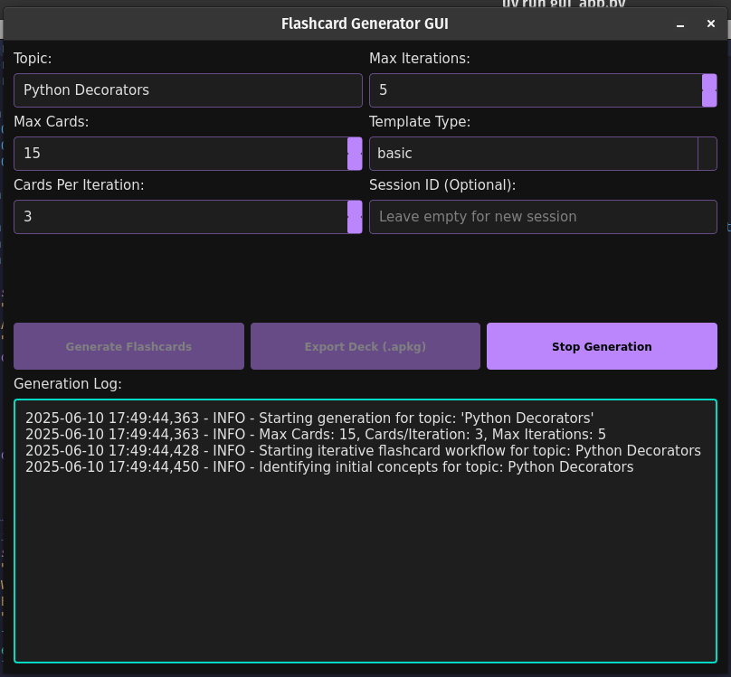

# AnkiGen: LLM-Powered Anki Flashcard Generator

AnkiGen is a command-line tool that uses LLMs to generate Anki decks on a given topic. It structures the generated content into a rich, customizable format and packages it into an Anki deck (`.apkg`) ready for import.

## Getting Started

### Prerequisites

* Python 3.9+ (or Python 3.7+ with `typing_extensions`)
* A Google API Key (for `gemini-2.0-flash` or `gemini-1.5-pro` LLMs)
* For the GUI: PyQt5 (`pip install PyQt5`)

### Installation

1.  `git clone`...
2.  Ensure [`uv`](https://github.com/astral-sh/uv) is installed
3.  Create a virtual environment and install dependencies:
    ```bash
    uv venv           # Creates a .venv directory
    source .venv/bin/activate # On Windows: .venv\Scripts\activate
    uv sync           # Installs dependencies from pyproject.toml
    ```

### Configuration

Ensure `GOOGLE_API_KEY` is set as an environment variable.

## Usage

AnkiGen can be used either via its Command-Line Interface (CLI) or through its experimental Graphical User Interface (GUI).

### Command-Line Interface (CLI)

Run the `main.py` script using the `typer` CLI.

#### Generate Flashcards (CLI)

To generate an Anki deck from the command line:

```bash
uv run main.py generate --topic "Advanced Ruby Metaprogramming" --num-cards 15 --workflow module
```

##### Workflow Types:

AnkiGen supports different workflow types for various learning structures:

* `--workflow topic`: Generate cards for a single focused topic
* `--workflow module`: Break a module into topics and generate cards (default)
* `--workflow subject`: Create a comprehensive subject with multiple modules 
* `--workflow iterative`: Legacy iterative approach

**Examples:**

```bash
# Single focused topic (10 cards)
uv run main.py generate --topic "Python List Comprehensions" --num-cards 10 --workflow topic

# Module with multiple topics (default, 20 cards distributed across topics)  
uv run main.py generate --topic "React Hooks" --num-cards 20 --workflow module

# Comprehensive subject (50 cards across multiple modules)
uv run main.py generate --topic "Machine Learning" --num-cards 50 --workflow subject
```

##### Options:

* `--topic`, `-t`: The main topic/module/subject for flashcard generation (required).
* `--num-cards`, `-n`: The number of flashcards to generate (required).
* `--workflow`, `-w`: Workflow type: 'topic', 'module', 'subject', or 'iterative' (default: 'module').
* `--model`, `-m`: The LLM model name to use (default: `gemini-2.0-flash`).
* `--output`, `-o`: The filename for the generated `.apkg` file (default: `generated_flashcards.apkg`). The file will be saved in `decks/` directory.
* `--deck-name`, `-d`: The name of the Anki deck that appears in Anki (default: Generated Flashcards: [Topic]).
* `--template`, `-r`: The Anki card template to use ("basic" or "comprehensive").
* `--session-id`, `-s`: A unique ID for this generation session (for resuming). If not provided, a new one will be generated.

##### Environment Variables:

* `GOOGLE_API_KEY`: Required Google API key for LLM access.
* `LOG_LEVEL`: Set logging level (DEBUG, INFO, WARNING, ERROR, CRITICAL). Default: INFO.

**Examples with environment variables:**
```bash
# Enable debug logging for detailed output
LOG_LEVEL=DEBUG uv run main.py generate --topic "Python Decorators" --num-cards 10

# Minimal logging output
LOG_LEVEL=WARNING uv run main.py generate --topic "German Grammar" --num-cards 15
```

#### Resume Generation (CLI)

If a session crashes or is interrupted, you can resume the workflow by providing the same session ID:

```bash
uv run main.py generate --topic "Advanced Ruby Metaprogramming" --session-id your_session_id_here
```

### Graphical User Interface (GUI) - Work in Progress

AnkiGen also provides a graphical interface for easier interaction, allowing you to input parameters and observe the generation process in real-time.

**Features (WIP):**
* Interactive input for topic, number of cards, and iteration parameters.
* Dropdown selection for different Anki card templates ("basic", "comprehensive").
* Real-time logging output from the generation process.
* One-click Anki deck export.

**How to Run the GUI:**

```bash
uv run gui_app.py
```


